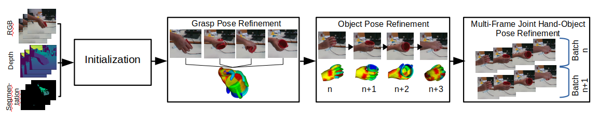
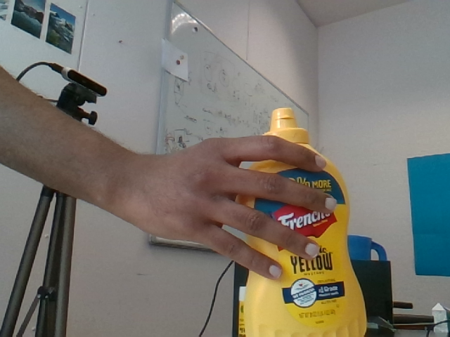
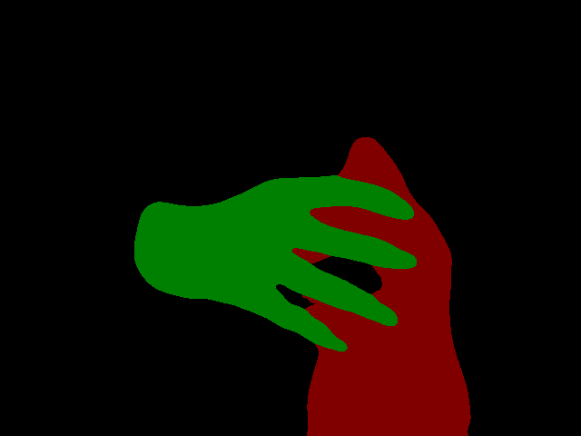
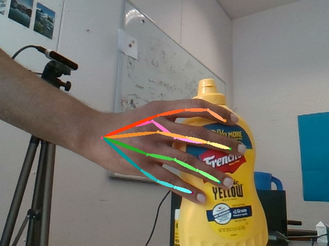
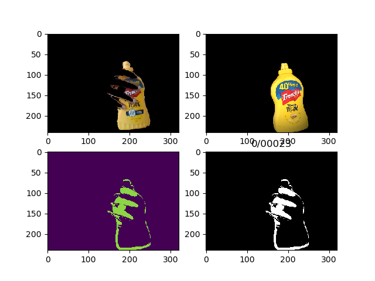
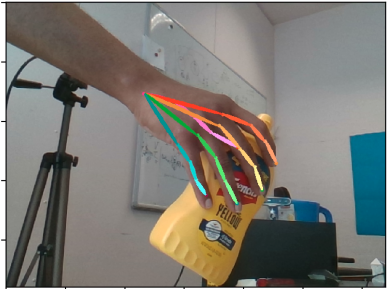
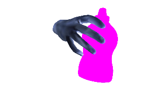

# HOnnotate: A method for 3D Annotation of Hand and Object Poses
Shreyas Hampali, Mahdi Rad, Markus Oberweger, Vincent Lepetit, CVPR 2020
- [Project page](https://www.tugraz.at/institute/icg/research/team-lepetit/research-projects/hand-object-3d-pose-annotation/)

This repository contains code for annotating 3D poses of hand and object when captured with a **single RGBD camera setup**.

# Citation
If this code base was helpful in your research work, please consider citing us:
```
@INPROCEEDINGS{hampali2020honnotate,
title={HOnnotate: A method for 3D Annotation of Hand and Object Poses},
author={Shreyas Hampali and Mahdi Rad and Markus Oberweger and Vincent Lepetit},
booktitle = {CVPR},
year = {2020}
}
```
# Installation
- This code has been tested with Tensorflow 1.12 and Python 3.5
- Create a conda environment and install the following main packages.
- Install DIRT differentiable renderer from [here](https://github.com/pmh47/dirt)
- Install pyRender from [here](https://pypi.org/project/pyrender/) (our code uses version 0.1.23)
- Install chumpy from [here](https://github.com/mattloper/chumpy) 
- Install the following additional packages.
```python
        pip install numpy matplotlib scikit-image transforms3d tqdm opencv-python cython open3d
```

# Setup
`HOnnotate_ROOT` is the directory where you download this repo.
- Clone the *deeplab* repository and checkout the commit on which our code is tested
```
            git clone https://github.com/tensorflow/models.git
            git checkout 834902277b8d9d38ef9982180aadcdaa0e5d24d3
```
- Copy **research/deeplab** and **research/slim** folders to **models** folder in ``HOnnotate_ROOT`` repo
- Download the checkpoint files (network weigts) from [here](https://files.icg.tugraz.at/f/f23053e075a140ca8756/?dl=1) and extract in ``HOnnotate_ROOT``
- Download the objects 3D corner files [here](https://files.icg.tugraz.at/f/b400540c6c81425e8978/?dl=1) and extract in `HOnnotate_ROOT`
- Download the YCB object models by clicking on The YCB-Video 3D Models in [https://rse-lab.cs.washington.edu/projects/posecnn/].
 Update the `YCB_MODELS_DIR` variable in `HOdatasets/mypaths.py` with the path where you unpacked the object models into (path to where *models* folder branches off). 
- Download and extract the `test` sequence from [here](https://files.icg.tugraz.at/f/1a55e8134bda4dd7938d/?dl=1) and update `HO3D_MULTI_CAMERA_DIR` variable in `HOdatasets/mypaths.py` with its location.
Note that the path should not contain the sequence name i.e., the path is until the `test` sequence folder. 
- Download Models&code from the MANO website. Assuming ${MANO_PATH} contains the path to where you unpacked the downloaded archive, use the provided script to setup the MANO folder as required.
```python
        cd ./optimization
        python setup_mano.py ${MANO_PATH}
        cd ../
```
- Finally, your folder structure should look like this:
```
            - checkpoints
                - CPM_Hand
                - Deeplab_seg
            - eval
            - HOdatasets
            - models
                - CPM
                - deeplab
                - slim
            - objCorners
                - 003_cracker_box
                - 004_sugar_box
                ....
            - onlineAug
            - optimization
            - utils
```

# Data Capture

- The codes in this repository allow annotation of hand-object 3D poses of sequences obtained from 
single RGBD camera setup.
- A test sequence captured on Intel RealSense D415 camera can be downloaded from [here](https://files.icg.tugraz.at/f/1a55e8134bda4dd7938d/?dl=1)
- Note that as explained in Section (4.2) of paper, **the grasp pose of the hand should vary marginally** throughout the sequence when captured on single camera setup. 
- Any new data captured from other camera setup should follow the same folder structure as in the test sequence.
- Folder structure:
```
        -test
            -rgb
                -0
                    -00001.png
                    -00002.png
                    .
                    .
            -depth
                -0
                        -00001.png
                        -00002.png
                        .
                        .
            -calibration
                -cam_0_depth_scale.txt
                -cam_0_instrinsics.txt
            -configs
                -configHandPose.json
                -configObjPose.json
```
*cam_0_depth_scale.txt* contains depth scale of the depth camera and *cam_0_instrinsics.txt* contains
camera instrinsics. **.json* in *configs* are used as inputs to the scripts (explained later).
Folder name *'0'* in *rgb* and *depth* folder correspond to camera ID, which is always *0* in single camera setup. 

# Run (Single camera setup)
Please refer to Section 4.2 in the [paper](https://arxiv.org/pdf/1907.01481.pdf). Below stages
for performing automatic hand-object pose annotation follows the same pipeline as in paper.


## 0. Keypoints and Segmentations
We use *deeplab* network for segmentation and *Convolutional pose machine* for hand
keypoint detection. The networks are trained with *HO3D* dataset and the weights
can be downloaded from [here](https://files.icg.tugraz.at/f/f23053e075a140ca8756/?dl=1)
 
### 0.1. Hand+Object segmentations
```
        python inference_seg.py --seq 'test'
```
The segmentations are saved in *segmentation* directory of the `test` sequence
<p align="center">
  
  
</p>

### 0.2. Hand 2D keypoints
This requires the segmentation script to be run beforehand
```.env
        python inference_hand.py --seq 'test'
```
The 2D keypoints are saved in *CPMHand* directory of the `test` sequence
<p align="center">
    
</p>

## 1. Hand and Object Pose Initializations


### 1.1. Object pose initialization
The object pose in all frames of the sequence is initialized by tracking. To reduce the effort of manual initialization,
the object pose in the first frame can be simple upright position. Before tracking the object pose,
the config file `configObjPose.json` in *configs* folder of the`test` sequence should be updated.
- `obj`: YCB name of the object used in the sequence
- `translationInit`: Initialization of object translation in the first frame. Should be
updated if the pose of the object is not upright in the first frame.
- `rotationInit`: Initialization of object rotation (axis-angle representation) in the first frame. Should be
updated if the pose of the object is not upright in the first frame.

The following script starts object tracking from the first frame of the sequence.

```python
        cd ./optimization
        python objectTrackingSingleFrame.py --seq 'test' --doPyRender
```
Remove `--doPyRender` flag to run the script faster. It only helps with the visualization.
The script creates *dirt_obj_pose* folder in the `test` sequence folder with the results of
optimization for each frame and below visualization.
<p align="center">
  
</p>
The above figure shows the input frame after object segmentation, object rendered in 
the initialization pose, depth map error and silhouette error.

### 1.2. Hand pose initialization
This script obtains initial 3D grasp pose of the hand relative to the object coordinate frame using the hand 2D keypoints detected earlier (step 0.2). Refer to Eq. (12) in paper for this optimization
for more details.
```python
        python handPoseMultiframeInit.py --seq 'test'
```
The optimization uses *chumpy* package and is hence slow. The results are 
stored in *handInit* folder of `test` sequence.
<p align="center">
  
  
</p>
The 2D keypoints are lifted to 3D keypoints and the resulting mesh is shown in the above figure.

## 2. Grasp Pose Estimation
A more accurate grasp pose of the hand is obtained using the initialization in step 1.2. Refer
to Eq. (13) in paper for more details. Modify the config file `configHandPose.json` in
*configs* folder of test sequence as in step 1.1. Update `betaFileName` field in the
json file to use different hand shape parameters or point to the correct beta files. Beta
parameters of 10 different subjects used in the dataset generation can be downloaded from [here](https://files.icg.tugraz.at/f/537f37c3c1c94e1a9eb2/?dl=1)

```python
        python handPoseMultiframe.py --seq 'test' --numIter 200 --showFig --doPyRender
```
Remove `--showFig` and `--doPyRender` flags to run faster without visualization. The results
of optimization and visualization (if enabled) will be dumped in *dirt_grasp_pose* folder of the 
`test` sequence.
<p align="center">
 
  
</p>
The first figure above shows the pose of object and hand during optimization. First row is 
 the input image, second row is the hand-object rendered with poses at current iteration, third and 
 fourth row shows the depth and silhoutte erro. The second figure above is the grasp pose of the hand after optimization.

## 3. Object Pose Estimation

A more accurate object pose is obtained by tracking the object poses as explained in Section 4.2 of paper. The difference between
this stage and *Object pose initialization* in step 1.1 is, the hand mesh rendered with the estimated
 grasp pose is also used in the optimization. Update the *configHandObjPose.json* file in *configs* folder
 of the `test` sequence as earlier in step 1.1.
 ```python
        python handObjectTrackingSingleFrame.py --seq 'test' --showFig --doPyRender
```
The results are dumped in *dirt_hand_obj_pose* folder of `test` sequence. 
 

## 4. Multi-frame Pose Refinement

This stage performs optimization over mutliple frames and over all the hand-object pose variables. Refer to Eq. (1) in paper.
The optimization is done in batches.
```python
        python handObjectRefinementMultiframe.py --seq 'test' --showFig --doPyRender --batchSize 20
```
The results are dumped in *dirt_hand_obj_refine* folder of `test` sequence.
<p align="center">
 
  
</p> 

# Known issues

The segmentation network often under-segmentents the hand near the finger tips. This results in a small shift in the final annotated keypoints of the finger tips. In order to account for this, the segmentation maps are corrected after Step 3 using the estimated keypoints and depth map. The segmentation correction script will be updated soon.
 

# Acknowledgements

- We would like to thank the authors of [Monocular total capture: Posing face, body, and hands in the wild](https://github.com/CMU-Perceptual-Computing-Lab/MonocularTotalCapture) for making the *Convolutional
pose machine* code public
- Thanks to the authors of [End-to-end Recovery of Human Shape and Pose](https://github.com/akanazawa/hmr#end-to-end-recovery-of-human-shape-and-pose) for making their
tensorflow MANO code public
- Thanks to [Yana Hasson](https://hassony2.github.io/) for proof reading the paper
